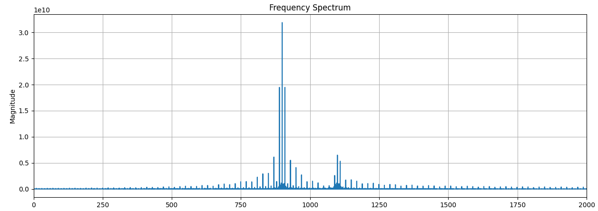
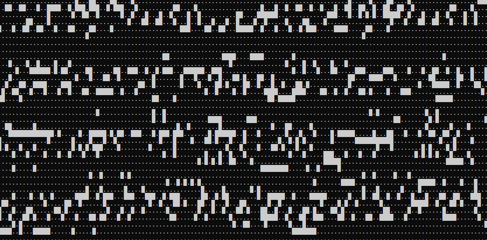
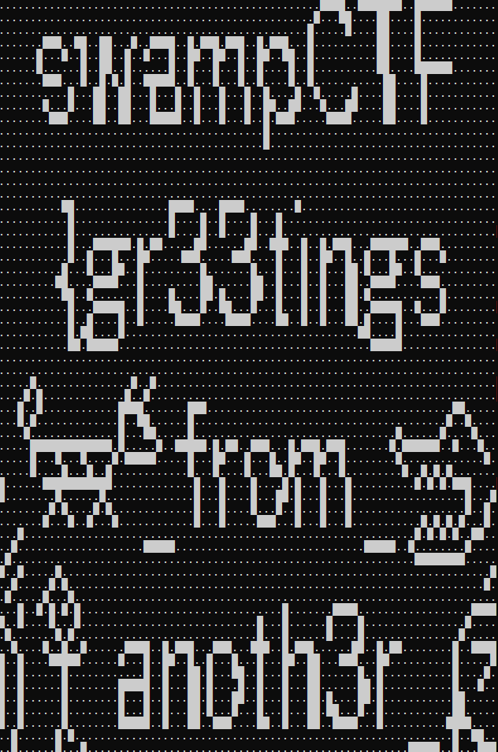

# Proto Proto
## Challenge

Moto Moto likes you. But not enough to explain how his server works. We got a pcap of the client and server communicating. Can you figure out how the server works and retrieve the flag?

`proto_proto.pcap`
## Solution

Proto Proto seems to be a simple gaming platform set up. If we pay attention to the UDP datagrams sent, we'll notice that after resolving the user at `172.19.0.2`, packets are sent, with a response later that contains the strings `flag.txt` and `secret.txt.

Looking into the other UDP packets, we can notice later that a packet is send with the strings `flag.txt` and a response of `swampCTF{d1d_y0u_r34lly_7h1nk_17_w0uld_b3_7h47_345y?}`. This gave hints to the format of the message. If we walk backwards from the end of the message from the request at packet 108, we can notice before flag.txt there are two numbers, `0x02` and `0x08`. Walking back to the previous commands we can see that there are likely command codes `0x00` and `0x02`.

We send a datagram with just a `0x00` and sure enough, we get a response containing the ASCII `flag.txt`. The syntax of the other command code was likely `<cmd-code><filename-size><filename>` and so we craft the payload `0208666c61672e747874` - basically what the `pcap` did and we get a response containing the real flag:

`swampCTF{r3v3r53_my_pr070_l1k3_m070_m070}`

# Proto Proto 2
## Challenge

Moto Moto heard you were able to reverse his server code, so he set up some "encryption". Can you figure out the key and retrieve the flag?

## Solution

To solve this challenge, I looked through the UDP packets again, similarly to Proto Proto. We can immediately notice two things: a command with code `0x01` and a change to the `0x02` syntax: `0x02<pw-length><pw><filename-length><filename>`

I noticed that `0x01<password>` had response codes, with `super_secret_password` giving a unique response from the rest. I tried requesting the files using this passcode but it returned junk. I played with the responses but nothing legible came out.

I tried querying to see if the server had a `secret.txt` like the `pcap` from the first challenge to no avail. Eventually I started throwing strings at the two file that it did return, which are `flag.txt` and `real_flag.txt`. I received interesting responses from flag.txt, any string containing `swampCTF` returned responses "i_do_rea..." and then junk. Noticing it was likely a simple XOR encryption, I tested out keywords, with `swampCTF{m070_m070_...` returning `i_do_real_encryption...` followed by junk.

Why not send that in?
`0x02i_do_real_encryptionflag.txt`

-->

 `swampCTF{m070_m070_54y5_x0r_15_4_n0_n0}`

# Preferential Treatment
## Challenge

We have an old Windows Server 2008 instance that we lost the password for. Can you see if you can find one in this packet capture?

`gpnightmare.pcap`
## Solution

This challenge was very straightforward, the `pcapng` file had an smb exchange which had a `groups.xml` file with contents
```
<?xml version="1.0" encoding="utf-8"?>
<Groups clsid="{3125E937-EC16-4b4c-9934-544FC6D24D26}">
    <User clsid="{DF5F1855-52E5-4d24-8B1A-D9BDE98BA1D1}" name="swampctf.com\Administrator" image="2"
          changed="2018-07-18 20:46:06" uid="{EF57DA28-5F69-4530-A59E-AAB58578219D}">
        <Properties action="U" newName="" fullName="" description=""
                    cpassword="dAw7VQvfj9rs53A8t4PudTVf85Ca5cmC1Xjx6TpI/cS8WD4D8DXbKiWIZslihdJw3Rf+ijboX7FgLW7pF0K6x7dfhQ8gxLq34ENGjN8eTOI="
                    changeLogon="0" noChange="1" neverExpires="1" acctDisabled="0" userName="swampctf.com\Administrator"/>
    </User>
</Groups>

```
Running the cpassword through Kali's `gpp-decrypt` yields the flag

# Message From The Stars
## Challenge

We recently detected this signal from deep space, we aren't quite sure what to make of it but we suspect it originated from intelligent life. Want to take a crack at decoding it?

`message_from_the_stars.wav`

## Solution
When it comes to audio, there are many ideas that come to mind, however, the challenge was simply two frequencies. I could immediately rule out Dual-Tone Multi-Frequency, dial-up, modems etc.

As a producer, it's pretty easy to extract frequencies and rhythms from an audio file, so I quickly plopped the file into FLStudio (rather than writing a script) and identified that the audio file was consistently playing sounds at 900Hz and 1100Hz. We could just double confirm this by plotting the frequency throughout the entire file.



It was beeping at around 13 per second, with this info we could write a quick script and transform the audio into a binary stream. I tried a couple things with the output, to no avail. Then I suddenly recalled an audio file from a video I saw in high school, the [Arecibo Message](https://archive.org/details/the-arecibo-message) which was essentially a message sent to the cosmos to broadcast our existence.

I thought it had to be connected, since it's literally "Messages From The Stars", so I tried encoding the bytes as colours and formed a bitmap, it did not work. By a stroke of luck, I put on my girlfriend's glasses to fiddle and at a distance, I noticed it: the ASCII art. I quickly transformed the 0's and 1's into `.` and `█`s and the result was

Write another bash script to vary the width and:


